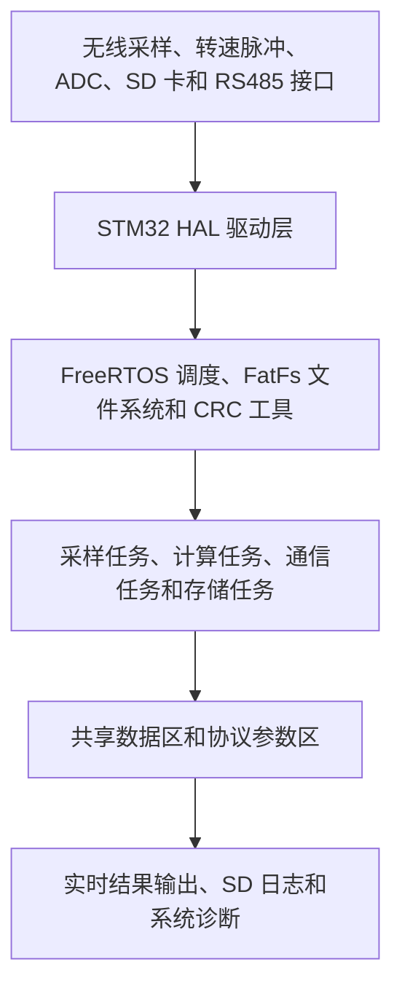
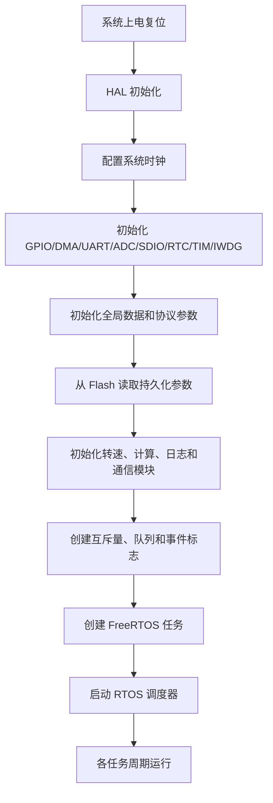
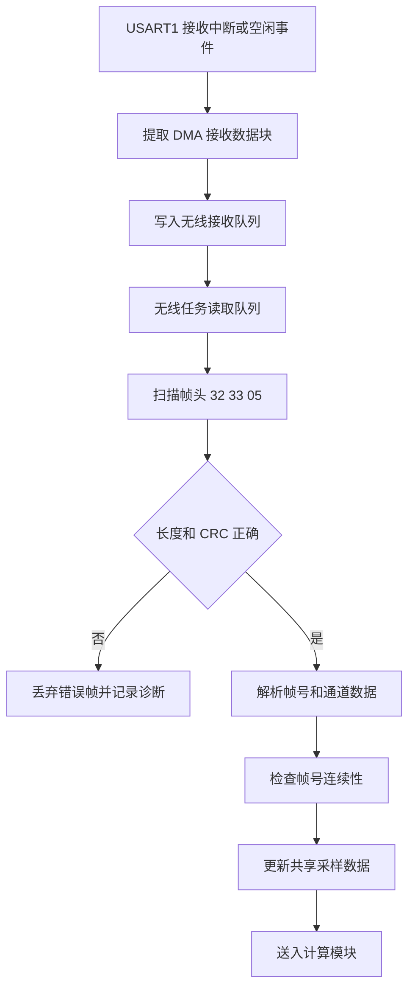
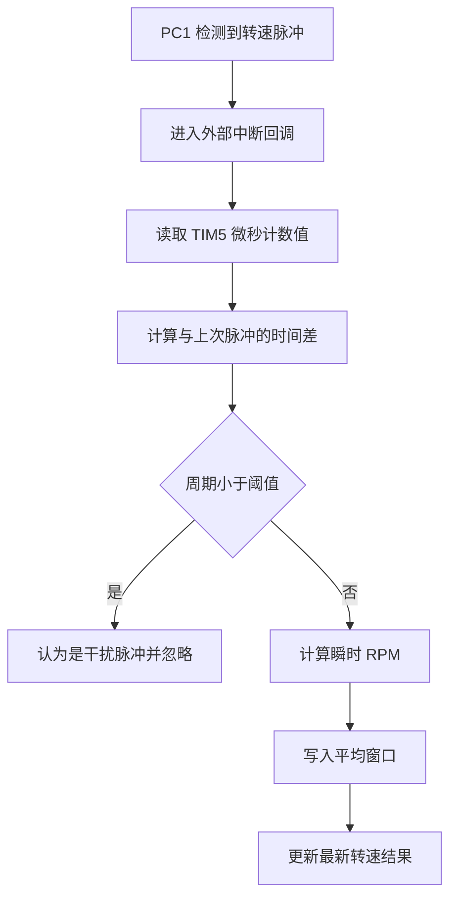
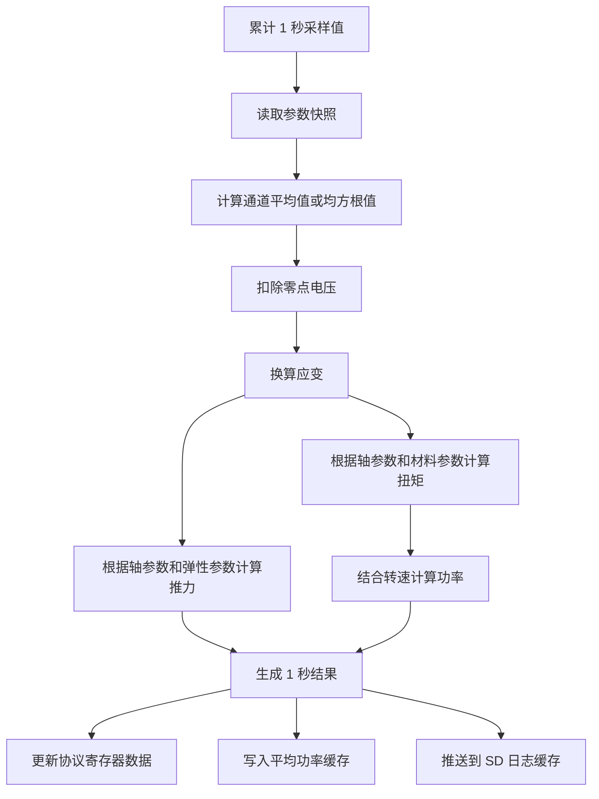
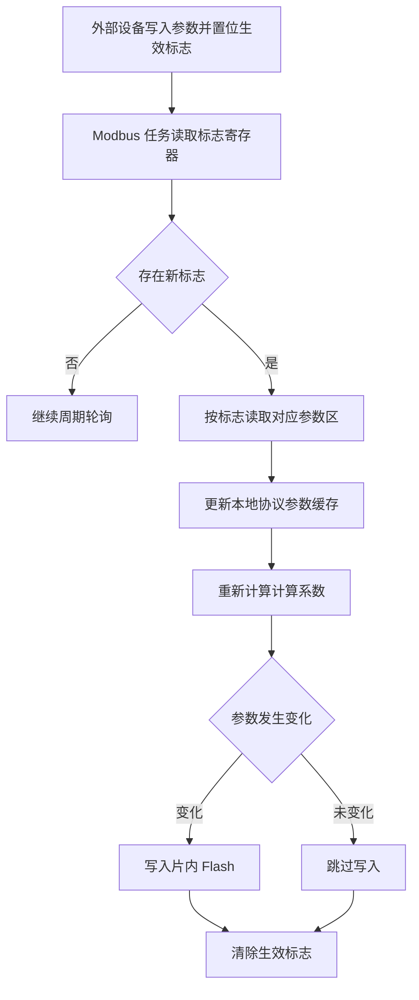
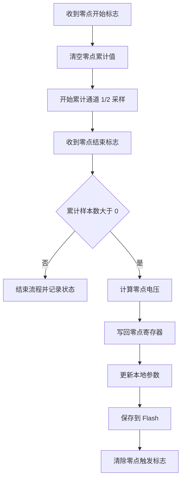
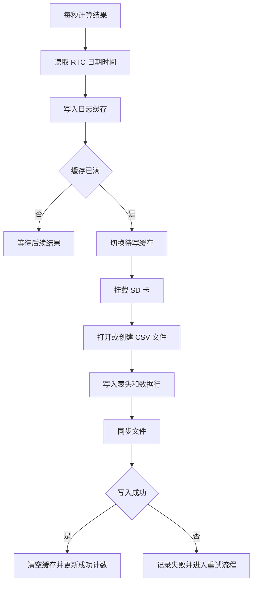

# 船用轴功率与推力仪定子软件设计说明书

## 1. 引言

### 1.1 编写目的

本文档用于说明“船用轴功率与推力仪定子软件”的总体设计、运行环境、功能结构、主要处理流程、数据结构、通信接口和异常处理方式，可作为软件著作权申请材料中的设计说明文件使用。

本文档依据当前固件源码工程整理，重点描述软件在无图形界面条件下完成的数据采集、数据处理、通信交互、数据存储和运行监控等功能。

### 1.2 软件名称

船用轴功率与推力仪定子软件。

### 1.3 软件类型

本软件为嵌入式控制类软件，无独立图形用户界面，运行于微控制器硬件平台，通过串口、RS485、SD 卡及相关外设完成数据采集、计算、通信和存储功能。

### 1.4 适用范围

本软件适用于船舶推进轴系功率、扭矩、转速和推力测量设备中的定子端控制单元。软件可用于接收无线采集模块上传的测量信号，采集轴系转速脉冲，计算轴功率和推力，并将结果提供给显示终端、上位设备或存储介质。

## 2. 软件概述

本软件运行于 STM32F407 系列微控制器平台，基于 STM32 HAL 驱动库、CMSIS-RTOS2/FreeRTOS 实时操作系统和 FatFs 文件系统实现。软件通过 USART1 接收无线采样模块上传的两路测量电压及状态信息，通过外部中断和定时器采集轴系转速脉冲，通过内置计算模型得到扭矩、转速、轴功率和推力等关键数据。

软件采用多任务架构，将无线通信、Modbus 通信、计算处理、结果输出、SD 卡日志、系统监控和看门狗刷新等功能分离到不同任务中运行。各任务通过消息队列、事件标志和互斥量进行协作，保证实时采样、周期计算和通信处理之间互不阻塞。

本软件主要功能包括：

1. 无线采样数据接收和解析。
2. 轴转速脉冲采集和转速计算。
3. 扭矩、功率、推力等测量结果计算。
4. 平均功率缓存和指定时间范围查询。
5. 参数读取、更新、保存和恢复。
6. Modbus 通信和结果寄存器写入。
7. 零点采集与零点电压自动计算。
8. SD 卡 CSV 日志记录。
9. 低压状态检测、通信异常恢复和看门狗保护。

## 3. 运行环境

### 3.1 硬件环境

| 项目 | 配置 | 用途 |
| --- | --- | --- |
| 主控芯片 | STM32F407 系列 Cortex-M4 微控制器 | 软件运行平台 |
| 系统时钟 | HSE + PLL，主频约 168 MHz | 系统运行时钟 |
| USART1 | 115200，8N1，DMA 接收/发送 | 无线采样模块通信 |
| USART2 | 9600，8N1，DMA 接收/发送，RS485 | 显示端或上位设备 Modbus 通信 |
| USART3 | 57600，8N1，RS485 | 可选结果输出 |
| UART6 | 57600，8N1，RS485/调试 | 调试日志及可选结果输出 |
| TIM5 | 32 位定时器，微秒计时 | 转速脉冲时间测量 |
| EXTI1/PC1 | 上升沿外部中断 | 转速脉冲输入 |
| ADC1/PC2 | 12 位 ADC 连续采样 | 外部低压状态检测 |
| SDIO + SD 卡 | FatFs 文件系统 | CSV 结果日志存储 |
| RTC | 24 小时制 | 日志时间戳 |
| IWDG | 独立看门狗 | 防止系统异常停滞 |

### 3.2 软件环境

| 项目 | 内容 |
| --- | --- |
| 开发语言 | C 语言 |
| 操作系统 | FreeRTOS/CMSIS-RTOS2 |
| 驱动库 | STM32 HAL |
| 文件系统 | FatFs |
| 编译方式 | GCC Makefile 工程 |
| 目标文件 | STM32F407 固件程序 |

## 4. 总体设计

### 4.1 总体架构

软件采用分层结构设计。底层为 STM32 HAL 外设驱动，包括 GPIO、DMA、UART、ADC、TIM、RTC、SDIO、IWDG 等。中间层包括 FreeRTOS 调度机制、FatFs 文件系统、Modbus CRC 与帧处理工具。应用层由无线采样、转速测量、计算处理、Modbus 通信、参数存储、结果输出、SD 日志和系统监控模块组成。

### 4.2 主程序流程

软件上电后完成硬件初始化、全局数据初始化、参数恢复、RTOS 对象创建和任务启动。进入操作系统调度后，各任务按固定周期运行，完成采样、计算、通信和记录。

### 4.3 任务划分

| 任务名称 | 运行周期 | 主要职责 |
| --- | --- | --- |
| defaultTask | 10 ms | 采集 PC2 ADC 电压并判断低压状态 |
| wirelessTask | 20 ms | 处理 USART1 无线采样帧、心跳和断流恢复 |
| modbusU2Task | 1000 ms | 与显示端或上位设备进行 Modbus 轮询 |
| calcLogTask | 1000 ms | 计算 1 秒扭矩、转速、功率、推力结果 |
| txResultTask | 1000 ms | 按配置通过 USART3/UART6 输出结果帧 |
| sdLogTask | 100 ms | 将缓存的结果写入 SD 卡 CSV 文件 |
| watchdogTask | 1000 ms | 刷新硬件看门狗 |
| monitorTask | 5000 ms | 输出心跳日志和诊断信息 |

## 5. 功能设计

### 5.1 无线采样数据接收

无线采样模块通过 USART1 向定子软件发送采样帧。软件使用 DMA + ReceiveToIdle 方式接收串口数据，接收完成后将数据块放入消息队列，由无线任务进行帧解析。采样帧包含帧头、帧号、两路浮点测量值、采集板状态值和 CRC 校验码。

软件对无线采样数据执行以下处理：

1. 扫描固定帧头。
2. 判断帧长度是否满足要求。
3. 计算并校验 Modbus CRC16。
4. 解析帧号并检查连续性。
5. 解析两路通道浮点数据和板端状态。
6. 更新最新无线采样值。
7. 将两路采样值送入计算模块。
8. 将板端状态用于低压状态判断。

当无线采样超过设定时间未收到有效帧时，软件启动自动恢复流程。恢复流程包括停止采样、设置采样频率、重新启动采样。若多次恢复失败，软件控制外部供电引脚对无线采集模块进行断电重启，然后重新配置采样。

### 5.2 轴转速测量

转速测量使用 PC1 外部中断和 TIM5 定时器实现。PC1 检测到转速脉冲上升沿时，软件读取 TIM5 当前计数值，与上一次脉冲时间相减得到周期。根据周期和每转脉冲数计算瞬时转速，并可进行窗口平均。

软件还会在每秒计算任务中执行转速超时检查。若长时间未收到新的转速脉冲，则认为轴系停转或信号中断，将转速结果置为零。

### 5.3 扭矩、功率和推力计算

计算模块按 1 秒周期运行。无线采样任务持续将两路通道数据送入计算模块，计算任务每秒读取累计数据，得到通道平均值或均方根值。软件根据零点电压、标定系数、应变片灵敏度、轴参数和材料参数计算应变、扭矩、推力和轴功率。

主要计算输入包括：

1. 通道 1 电压。
2. 通道 2 电压。
3. 零点电压。
4. 校验系数。
5. 应变片灵敏度。
6. 轴外径和轴内径。
7. 剪切模量、弹性模量和泊松比。
8. 螺旋桨旋向。
9. 转速值。

主要输出包括：

1. 扭矩，单位 kNm。
2. 功率，单位 kW。
3. 转速，单位 r/min。
4. 推力，单位 kN。
5. 状态标志。

### 5.4 平均功率统计

软件提供平均功率查询功能。计算任务每秒将功率结果写入平均功率缓存。缓存由秒级环形缓冲区和历史分桶缓冲区组成，可支持 0.1 小时至 24 小时范围内的平均功率查询。

当外部设备通过 Modbus 设置平均功率查询时间并置位生效标志后，软件读取查询时间，计算对应时间范围内的平均功率，并将结果写入平均功率寄存器，供显示端或上位机读取。

### 5.5 参数配置与持久化

软件通过协议寄存器维护计算和测量参数。参数主要包括平均功率查询时间、轴外径、轴内径、剪切模量、弹性模量、泊松比、螺旋桨旋向、使用模量、采样频率、平均方式、标定系数、应变片灵敏度和零点电压等。

参数更新流程如下：

Flash 存储区保存参数记录时包含魔数、版本号、数据长度和 CRC 校验值。软件上电后先检查存储记录合法性，校验通过后恢复参数，校验失败则使用默认参数或运行时配置。

### 5.6 零点校准

零点校准由外部设备通过寄存器触发。设置零点开始标志后，软件开始累计当前采样数据；设置零点结束标志后，软件停止累计并计算两路通道的零点电压。计算完成后，软件将零点电压写入协议参数区，并保存到 Flash。

### 5.7 Modbus 通信

USART2 用于与显示端或上位设备进行 Modbus 通信。软件作为主站周期性执行两类操作：一是将计算结果写入外部设备寄存器；二是读取外部设备中的参数生效标志和参数数据。

周期写入的数据包括：

| 地址 | 内容 | 类型 |
| --- | --- | --- |
| 0x07D0 | 扭矩 | float |
| 0x07D2 | 功率 | float |
| 0x07D4 | 转速 | float |
| 0x07D6 | 推力 | float |
| 0x07D8 | PC2 低压状态 | short |
| 0x07D9 | 采集板低压状态 | short |
| 0x07DA | 平均功率 | float |
| 0x07DC | 无线帧号 | short |

参数配置区包括：

| 地址 | 内容 | 类型 |
| --- | --- | --- |
| 0x09C4 | 平均功率查询时间 | float |
| 0x09C6 | 轴外径 | float |
| 0x09C8 | 轴内径 | float |
| 0x09CA | 剪切模量 | float |
| 0x09CC | 弹性模量 | float |
| 0x09CE | 泊松比 | float |
| 0x09D0 | 螺旋桨旋向 | short |
| 0x09D1 | 使用模量 | short |
| 0x09D2 | 采样频率 | float |
| 0x09D4 | 平均时间 | int32 |
| 0x09D6 | 平均方式 | short |
| 0x09D7/0x09D9 | 校验系数 | float |
| 0x09DB/0x09DD | 应变片灵敏度 | float |
| 0x09DF/0x09E1 | 零点电压 | float |
| 0x09E3 | 零点开始 | short |
| 0x09E4 | 零点结束 | short |

### 5.8 结果输出

除 USART2 的 Modbus 交互外，软件还可根据配置通过 USART3 或 UART6 输出结果数据帧。结果帧采用写多寄存器格式，包含扭矩、功率、转速和推力四个浮点结果。外部设备可根据需要接收该结果帧，实现显示或二次采集。

### 5.9 SD 卡日志记录

软件每秒生成一次计算结果，并将结果写入 SD 卡日志缓存。SD 日志任务周期检测缓存状态，当缓存达到设定数量后，创建或打开 CSV 文件并追加写入。日志文件名包含日期时间，文件内容包括时间、扭矩、推力、转速、功率和状态标志。

### 5.10 低压检测和状态监测

软件通过 ADC1 持续采样 PC2 电压。当电压连续低于设定阈值时，置位 PC2 低压状态。无线采样帧中的采集板状态值也用于判断采集板低压。低压状态会写入协议寄存器，并随结果上报给外部设备。

软件同时维护通信、SD 卡、看门狗等诊断计数，用于判断系统运行状态。监控任务周期输出心跳日志，便于调试和维护。

### 5.11 看门狗保护

软件配置独立看门狗，周期任务按固定时间刷新看门狗。如果系统任务异常阻塞导致无法刷新，看门狗将触发复位。软件启动后会输出复位原因，便于判断是否发生看门狗复位、电源复位或软件复位。

## 6. 数据设计

### 6.1 主要数据结构

软件核心共享数据包括无线采样数据、转速数据、1 秒计算结果、协议参数和诊断计数。

| 数据结构 | 主要内容 | 用途 |
| --- | --- | --- |
| wireless_sample_t | 通道 1、通道 2、板端状态、帧号、时间戳、有效标志 | 保存最新无线采样结果 |
| rpm_data_t | 转速、脉冲周期、有效标志 | 保存最新转速测量结果 |
| result_1s_t | 扭矩、推力、转速、功率、状态标志、时间戳 | 保存 1 秒计算结果 |
| protocol_values_t | 测量结果、配置参数、零点参数、生效标志 | 协议寄存器映射和计算参数缓存 |
| diag_counters_t | 串口、Modbus、SD 卡、看门狗等计数 | 诊断和状态统计 |

### 6.2 数据同步方式

共享数据由互斥量保护，避免多个任务同时读写导致数据不一致。串口中断接收的数据通过消息队列传递到任务中处理。采样更新、Modbus 更新和计算结果更新通过事件标志或共享缓存通知相关任务。

## 7. 接口设计

### 7.1 USART1 无线采样接口

USART1 接口用于连接无线采样模块。软件发送 9 字节控制帧，包括开始采样、停止采样、设置采样频率和心跳命令。无线模块返回 19 字节采样帧，包含帧号、两路浮点通道值和板端状态。

### 7.2 USART2 Modbus 接口

USART2 接口用于连接显示端或上位设备。软件通过 Modbus 读保持寄存器和写多个寄存器功能进行通信。通信数据包括实时测量结果、平均功率、低压状态、参数配置、生效标志和零点控制等。

### 7.3 USART3/UART6 结果输出接口

USART3 和 UART6 可根据参数配置输出结果帧。结果帧包含扭矩、功率、转速和推力，可用于连接其他显示设备或采集系统。UART6 还可作为调试日志输出接口。

### 7.4 SD 卡文件接口

软件使用 FatFs 文件系统访问 SD 卡。日志文件为 CSV 格式，便于后续通过常规表格软件或数据分析软件读取。

## 8. 异常处理设计

### 8.1 无线通信异常处理

当无线采样超时后，软件先尝试重新启动采样流程。若多次恢复失败，则控制外部供电引脚对采样模块进行断电重启，并重新设置采样频率。异常期间，计算模块可强制使用零点输入，避免错误采样导致异常计算结果。

### 8.2 Modbus 通信异常处理

Modbus 请求设置超时时间。若发送、接收或响应解析失败，软件记录失败计数和超时计数，并对接收 DMA 进行恢复。部分写操作在超时时会重试一次，以提高通信稳定性。

### 8.3 SD 卡异常处理

当 SD 卡挂载、打开文件、写入或同步失败时，软件记录失败阶段和错误码，关闭当前文件状态并进入离线检测流程。对于疑似拔卡或磁盘错误，软件采用退避重试策略周期探测 SD 卡恢复情况。

### 8.4 参数存储异常处理

参数读取时，软件校验魔数、版本、长度和 CRC。校验失败时不使用无效参数。参数写入时，如 Flash 解锁、擦除或编程失败，软件记录错误并保持原有运行参数。

### 8.5 系统运行异常处理

软件启用独立看门狗进行系统保护，并设置 FreeRTOS 内存分配失败钩子和栈溢出钩子。一旦发生严重错误，软件进入保护状态或依靠看门狗复位恢复。

## 9. 安全性与可靠性设计

1. 采样帧和 Modbus 帧均采用 CRC 校验，降低错误数据被使用的概率。
2. 转速脉冲设置最小周期过滤，减少干扰脉冲影响。
3. 共享数据使用互斥量保护，避免并发访问错误。
4. 参数持久化采用 CRC 校验，避免掉电或写入异常造成无效参数加载。
5. SD 卡写入采用缓存机制和异常重试机制，降低瞬时故障影响。
6. 无线采样具备自动恢复和外部模块断电重启能力。
7. 系统启用独立看门狗，提升长期运行稳定性。

## 10. 软件模块说明

| 模块 | 文件 | 说明 |
| --- | --- | --- |
| 主程序和任务调度 | Core/Src/main.c | 外设初始化、RTOS 对象创建、任务启动和 HAL 回调分发 |
| 无线采样模块 | Core/Src/app_usart1.c | USART1 控制命令发送、采样帧解析和异常恢复 |
| 转速测量模块 | Core/Src/rpm.c | 转速脉冲周期计算、平均和超时处理 |
| 计算模块 | Core/Src/app_calc.c | 零点采集、应变换算、扭矩/推力/功率计算 |
| Modbus 工具模块 | Core/Src/modbus_master.c | CRC16、Modbus 请求构造和响应解析 |
| 显示通信模块 | Core/Src/app_modbus_u2.c | USART2 Modbus 轮询、结果写入和参数读取 |
| 协议映射模块 | Core/Src/protocol_map.c | 协议寄存器地址到内部数据字段的映射 |
| 平均功率模块 | Core/Src/app_avg_power_cache.c | 功率缓存和指定时间平均功率查询 |
| 参数存储模块 | Core/Src/app_param_store.c | 参数 Flash 读取、校验和保存 |
| 结果输出模块 | Core/Src/app_tx_result.c | USART3/UART6 结果帧构造与发送 |
| SD 日志模块 | Core/Src/app_log_sd.c | CSV 文件缓存、写入和异常重试 |

## 11. 编译与部署

软件工程采用 Makefile 方式编译，目标平台为 STM32F407 微控制器。编译生成的固件文件通过常规 STM32 烧录工具写入目标设备 Flash。设备上电后自动运行，完成初始化后进入 FreeRTOS 多任务调度，无需用户图形界面操作。

部署步骤如下：

1. 配置交叉编译工具链。
2. 执行工程编译，生成目标固件。
3. 将固件烧录至 STM32F407 控制板。
4. 连接无线采样模块、转速脉冲输入、显示端 RS485、SD 卡等外设。
5. 上电运行，设备自动完成采样、计算、通信和日志记录。

## 12. 结论

本软件围绕船舶轴功率与推力测量需求，完成了无线采样接收、转速测量、扭矩计算、功率计算、推力计算、平均功率统计、参数配置、零点校准、Modbus 通信、结果输出、SD 卡记录和故障保护等功能。软件结构清晰，模块划分明确，具备实时性、可维护性和现场运行可靠性，能够满足船用轴功率与推力仪定子端嵌入式控制软件的使用要求。
